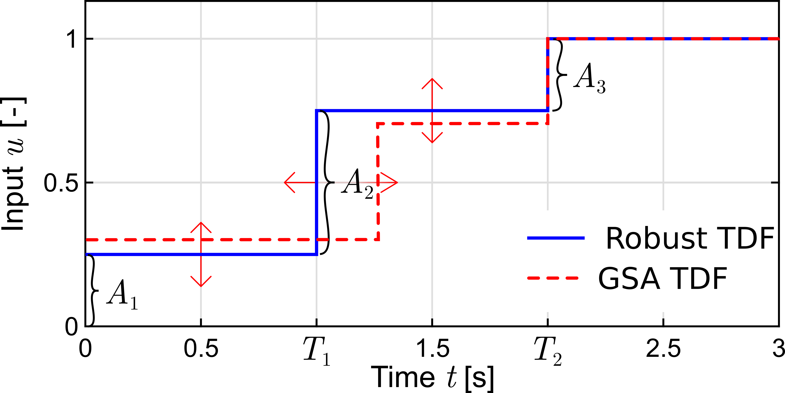
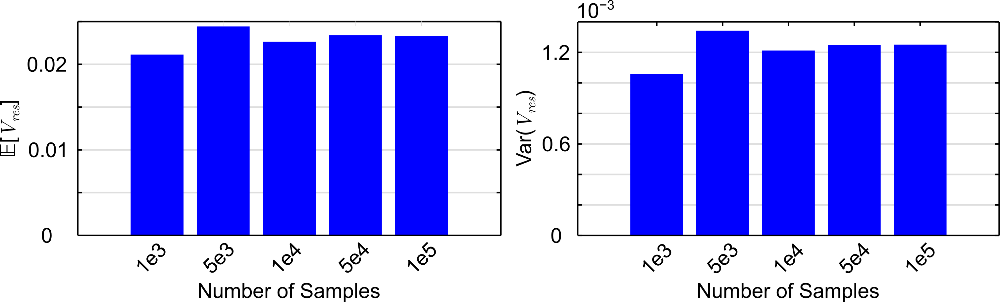
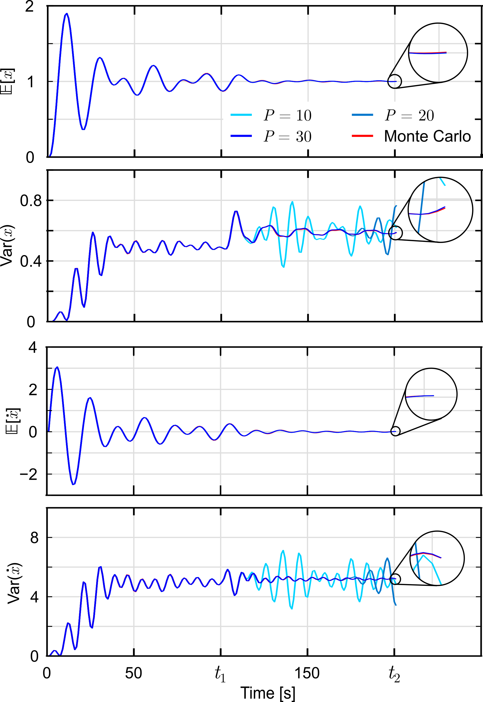
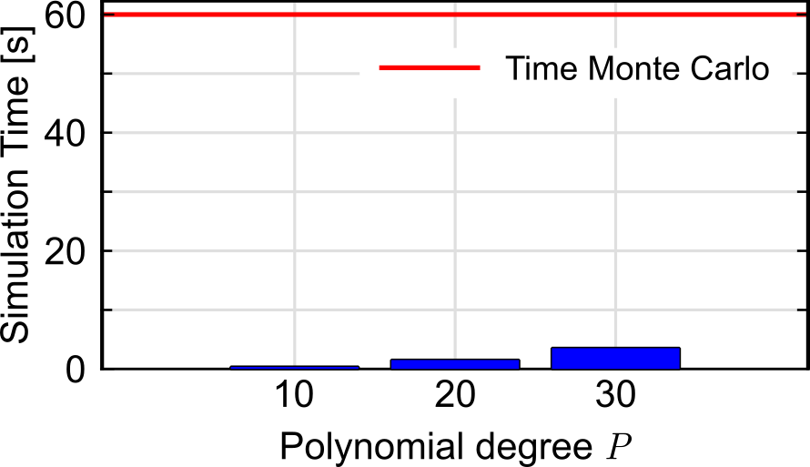
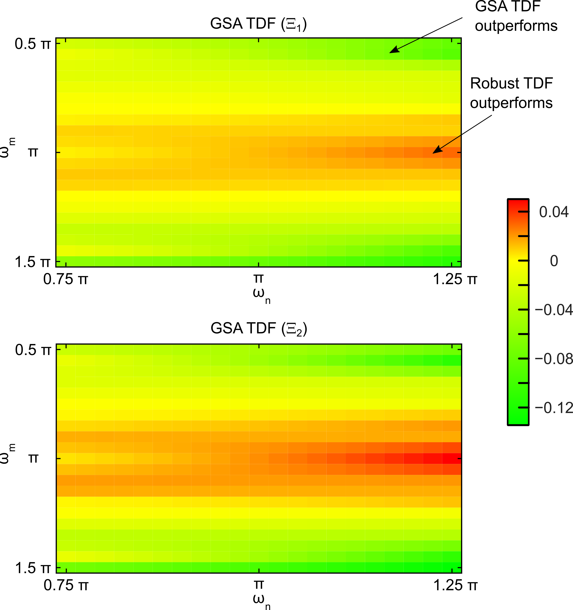

# Repository for ACC 2026 Paper

This repository contains the MATLAB code used in the paper:

**"Polynomial Chaos-based Input Shaper Design under Time-Varying Uncertainty"**  
Accepted at **American Control Conference (ACC) 2026**.

📄 Preprint available on arXiv:  
https://arxiv.org/abs/2601.17209

If you use this code in your research, please cite the paper.

---

# MATLAB Scripts Overview

This repository contains MATLAB programs for evaluating **time-delay filters (TDFs)** for a spring–mass system using **Monte Carlo (MC) simulations**, **Polynomial Chaos Expansion (PCE)**, and **Global Sensitivity Analysis (GSA)**.

  

---

# MC_Spring_Mass_*.m

These scripts perform **Monte Carlo simulations for different TDF configurations**.

## Outputs

Each program generates **three bar charts**:

1. **Expected residual energy at t₂ per sample size**
2. **Variance of residual energy at t₂ per sample size**  
   - Figures (1) and (2) together correspond to **Figure 2**
3. **Computation time per sample size**

## Sample Sizes

The default tested sample sizes are: [1000 5000 10000 50000 100000]

This vector can be modified. A vector with a **single entry** can also be used to compute only one result.

  

## Additional Outputs (Robust TDF only)

For the **robust TDF**, the Monte Carlo simulation also saves:

- Expected value of the **state x over time**
- Variance of the **state x over time**
- Expected value of the **velocity x_dot over time**
- Variance of the **velocity x_dot over time**

These results are saved as:
means_MC_vec.mat
vars_MC_vec.mat

---

# PCE_exp_var_over_time.m

This script computes the **expected value and variance** of

- state **x**
- velocity **x_dot**

over time using a **Polynomial Chaos Expansion (PCE)** approximation.

## Polynomial Degrees Tested

The following polynomial orders are evaluated:
p = [10 20 30]

  

## Outputs

The computed values are saved as:
means_PCE_mat.mat
vars_PCE_mat.mat

A **bar chart showing the computation time for each polynomial degree** is also generated (**Figure 4**).

  

---

# convergence_MC_PCE.m

This script compares the **Monte Carlo simulation results with the PCE approximation** to verify convergence.

## Functionality

- Loads the previously saved MC and PCE results
- Generates **Figure 3**, which compares both approaches

## Important

The following scripts must be executed beforehand:

- `MC_Spring_Mass_rob_TDF.m`
- `PCE_exp_var_over_time.m`

Otherwise the required `.mat` files will not exist and the script will produce an error.

---

# GSA_vs_Robust.m

This script compares the performance of a **GSA-based TDF** and a **robust TDF**.

## Program Structure

### Part 1

Constructs a **PCE model for the GSA TDF**.

### Part 2

Creates **two heatmaps (Figure 5)** that show the difference in residual energy at t₂ between the two TDFs.

### Heatmap 1

- The GSA TDF is optimized to **minimize the variance of the residual energy at t₂**
- The resulting **colormap is saved and reused** for the second heatmap to ensure comparability

### Heatmap 2

- The GSA TDF is optimized to **minimize the expected value of the residual energy at t₂**

Because the first heatmap has the **larger value range**, its colormap is reused for the second heatmap instead of the other way around.

## Interpretation

- **Red (positive values):** the robust TDF performs better
- **Green (negative values):** the GSA TDF performs better

  

